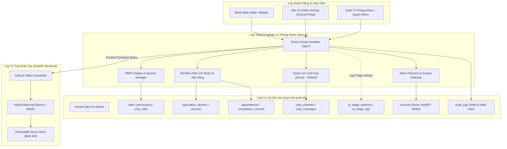
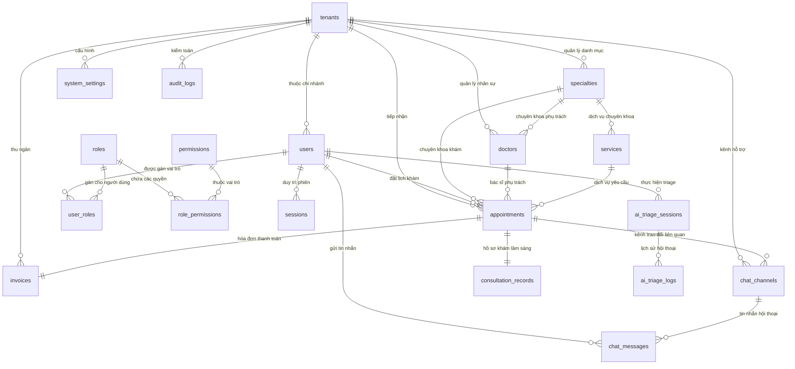
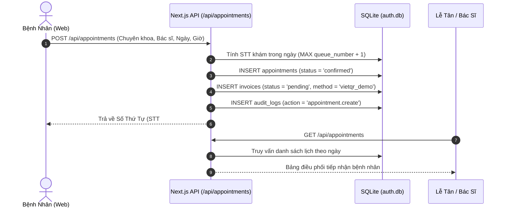
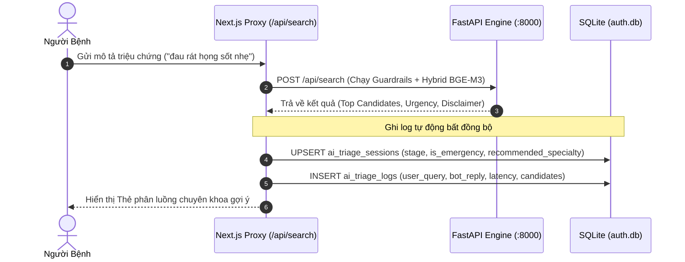
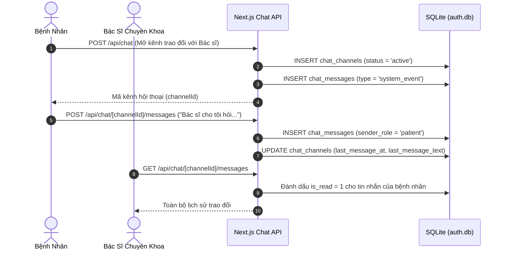

# BotMedical - Kiến Trúc Cơ Sở Dữ Liệu SaaS & Quản Lý Phân Quyền (Database-First)

> **Thương hiệu**: Phòng khám Đa khoa Quốc tế YG (YG Clinic)
> **Phiên bản kiến trúc**: SaaS v2.0 Enterprise
> **Phương pháp tiếp cận**: Database-First Multi-Tenant Role-Based Access Control (RBAC)
> **Engine lưu trữ**: SQLite 3 (WAL Mode, Foreign Key Enforced) + ChromaDB (Vector Knowledge Base)

---

## 1. Tổng Quan Kiến Trúc (Executive Architecture Overview)

Hệ thống **BotMedical** được thiết kế theo mô hình lai (Hybrid Architecture) kết hợp giữa:
1. **SaaS Application Core (Next.js 15 App Router + SQLite `auth.db`)**: Phụ trách phân hệ định danh (Authentication), đa chi nhánh (Multi-Tenant), phân quyền theo vai trò (RBAC), quy trình đặt lịch khám (Appointment Workflow), kênh tương tác trực tuyến (SaaS Live Chat), và thanh toán thử nghiệm (Demo Invoicing).
2. **AI Clinical Intelligence Core (FastAPI + ChromaDB + BGE-M3)**: Phụ trách sàng lọc và phân luồng triệu chứng y khoa (AI Triage), hệ thống rào chắn an toàn (Deterministic Clinical Guardrails) và truy vấn tri thức bệnh học đa tầng.

---

## 2. Lược Đồ Thực Thể Quan Hệ (Entity-Relationship Diagram - ERD)

Toàn bộ 16 bảng dữ liệu quan hệ được đồng bộ hóa và quản trị trong `auth.db` với ràng buộc khóa ngoại nghiêm ngặt:

---

## 3. Chi Tiết Phân Hệ Cơ Sở Dữ Liệu (Schema Specifications)

### 3.1. Phân Hệ Tổ Chức & Chi Nhánh (Multi-Tenant)
Cho phép quản lý đa cơ sở khám chữa bệnh trên cùng một cơ sở hạ tầng dữ liệu:
* **`tenants`**:
  * `id TEXT PRIMARY KEY`: Mã định danh chi nhánh (VD: `yg-clinic-hn`).
  * `name TEXT NOT NULL`: Tên hiển thị chi nhánh.
  * `code TEXT UNIQUE NOT NULL`: Mã code ký hiệu (VD: `YG_HN_01`).
  * `brand_name TEXT`: Tên thương hiệu ("Phòng khám Đa khoa Quốc tế YG").
  * `license_number TEXT`: Giấy phép hoạt động khám chữa bệnh của Bộ Y tế.
  * `hotline TEXT`, `address TEXT`: Thông tin liên hệ và cơ sở tiếp nhận.
  * `is_active INTEGER DEFAULT 1`: Trạng thái hoạt động.

### 3.2. Phân Hệ Người Dùng & Phân Quyền Vai Trò (RBAC)
Mô hình RBAC phân cấp hoàn chỉnh bảo vệ các nghiệp vụ trọng yếu:
* **`roles`**:
  * `super_admin`: Toàn quyền quản trị hạ tầng, tenant, phân quyền và cấu hình.
  * `clinic_admin`: Quản trị chi nhánh phòng khám, bác sĩ, bảng giá và dịch vụ.
  * `doctor`: Bác sĩ lâm sàng, xem danh sách khám, ghi chẩn đoán, chat tư vấn.
  * `staff`: Lễ tân, điều dưỡng, tiếp đón bệnh nhân, xếp hàng, thu ngân demo.
  * `patient`: Bệnh nhân, đặt lịch, xem lịch sử khám, chat hỏi bác sĩ, AI Triage.
* **`permissions`**: Bảng định nghĩa các quyền nguyên tử (`appointment.book`, `appointment.manage`, `medical_record.write`, `chat.consult`, `billing.manage`, `audit.view`, ...).
* **`role_permissions`**: Bảng nối gán quyền hạn cho từng vai trò cụ thể.
* **`user_roles`**: Bảng phân công vai trò cho người dùng kèm phạm vi chi nhánh (`tenant_id`).

### 3.3. Phân Hệ Danh Mục Y Tế & Chuyên Khoa
* **`specialties`**: Danh mục chuyên khoa (Tai Mũi Họng, Nhi Khoa, Tiêu Hóa, Tim Mạch, Da Liễu, ...).
* **`doctors`**: Hồ sơ bác sĩ (Họ tên, học vị, chuyên khoa, số năm kinh nghiệm, lịch làm việc, giá khám).
* **`services`**: Danh mục dịch vụ khám, xét nghiệm, chẩn đoán hình ảnh và gói khám sức khỏe.

### 3.4. Phân Hệ Tiếp Đón, Lịch Khám & Hồ Sơ Bệnh Án
* **`appointments`**:
  * `queue_number INTEGER`: Số thứ tự khám được cấp tự động trong ngày cho từng chuyên khoa.
  * `status TEXT`: Vòng đời trạng thái lịch hẹn: `pending` ➔ `confirmed` ➔ `checked_in` ➔ `in_consultation` ➔ `completed` / `cancelled` / `no_show`.
  * `checkin_at`, `completed_at`: Dấu mốc thời gian phục vụ đo lường thời gian chờ của bệnh nhân.
* **`consultation_records`**: Hồ sơ kết luận lâm sàng do bác sĩ điền (Bệnh sử sơ bộ, chẩn đoán xác định, phác đồ điều trị, đơn thuốc tóm tắt).

### 3.5. Phân Hệ Trò Chuyện Trực Tuyến (SaaS Live Chat Hub)
* **`chat_channels`**:
  * Quản lý phiên hội thoại giữa bệnh nhân và bác sĩ chuyên khoa hoặc nhân viên tư vấn.
  * Hỗ trợ liên kết trực tiếp với mã cuộc hẹn (`appointment_id`).
* **`chat_messages`**:
  * Hỗ trợ các loại tin nhắn: văn bản (`text`), hình ảnh (`image`), sự kiện hệ thống (`system_event`), thẻ thông tin sàng lọc AI (`triage_card`).
  * Theo dõi trạng thái đã đọc (`is_read`) cho từng tin nhắn.

### 3.6. Phân Hệ Nhật Ký Trí Tuệ Nhân Tạo (AI Triage Logging)
* **`ai_triage_sessions`**: Ghi nhận từng phiên tương tác hỏi đáp triệu chứng giữa bệnh nhân và trợ lý AI YG. Lưu trữ `chief_complaint`, cờ báo cấp cứu khẩn cấp (`is_emergency`), mã luật cấp cứu vi phạm (`emergency_rule_id`), và mã chuyên khoa đề xuất (`recommended_specialty_id`).
* **`ai_triage_logs`**: Chi tiết từng lượt trao đổi (turn-by-turn), bao gồm câu hỏi của người dùng, phản hồi của bot, danh sách triệu chứng bóc tách (`extracted_symptoms`), danh sách ứng viên bệnh lý (`top_candidates`), độ trễ xử lý (`latency_ms`).

### 3.7. Phân Hệ Thu Ngân & Thanh Toán Thử Nghiệm (Demo Mode)
* **`invoices`**:
  * Quản lý hóa đơn viện phí theo mã lịch hẹn.
  * Phương thức thanh toán demo: `vietqr_demo`, `momo_demo`, `cash_demo`.
  * Trạng thái thanh toán: `pending`, `mock_success`, `failed`, `refunded`.
  * Mã giao dịch thử nghiệm tự sinh (`TXN-DEMO-XXXXXX`).

---

## 4. Ma Trận Phân Quyền Vai Trò (RBAC Permission Matrix)

| Nhóm Quyền | Mã Quyền (Code) | Super Admin | Clinic Admin | Doctor | Staff / Lễ Tân | Patient |
|:---|:---|:---:|:---:|:---:|:---:|:---:|
| **Hệ thống** | `tenant.manage` | ✅ | ❌ | ❌ | ❌ | ❌ |
| **Hệ thống** | `rbac.manage` | ✅ | ❌ | ❌ | ❌ | ❌ |
| **Hệ thống** | `audit.view` | ✅ | ✅ | ❌ | ❌ | ❌ |
| **Danh mục** | `specialty.manage` | ✅ | ✅ | ❌ | ❌ | ❌ |
| **Bác sĩ** | `doctor.manage` | ✅ | ✅ | ❌ | ❌ | ❌ |
| **Lịch hẹn** | `appointment.book` | ✅ | ✅ | ❌ | ✅ | ✅ |
| **Lịch hẹn** | `appointment.view_own` | ✅ | ✅ | ✅ | ✅ | ✅ |
| **Lịch hẹn** | `appointment.manage` | ✅ | ✅ | ❌ | ✅ | ❌ |
| **Lâm sàng** | `consultation.write` | ✅ | ❌ | ✅ | ❌ | ❌ |
| **Lâm sàng** | `consultation.read` | ✅ | ✅ | ✅ | ✅ | (Hồ sơ cá nhân) |
| **Hội thoại** | `chat.send` | ✅ | ✅ | ✅ | ✅ | ✅ |
| **Hội thoại** | `chat.manage` | ✅ | ✅ | ✅ | ✅ | ❌ |
| **Trợ lý AI** | `triage.use` | ✅ | ✅ | ✅ | ✅ | ✅ |
| **Viện phí** | `billing.mock_pay` | ✅ | ✅ | ❌ | ✅ | ✅ |

---

## 5. Quy Trình Nghiệp Vụ Chính (Key Operational Workflows)

### 5.1. Quy Trình Tiếp Nhận & Đặt Lịch Khám Bệnh

### 5.2. Quy Trình Sàng Lọc Triệu Chứng AI & Ghi Nhật Ký Triage

### 5.3. Quy Trình Kênh Trao Đổi Bác Sĩ - Bệnh Nhân (SaaS Live Chat)

---

## 6. Danh Sách Endpoint REST API Hệ Thống

| Nhóm API | Phương Thức | Đường Dẫn (Endpoint) | Quyền Truy Cập | Chức Năng |
|:---|:---:|:---|:---|:---|
| **Auth & Profile** | `GET` | `/api/auth/me` | Logged In | Trả về thông tin user, vai trò (`roles`), danh sách quyền (`permissions`), và lịch khám |
| **Lịch Khám** | `GET` | `/api/appointments` | User / Doctor / Admin | Xem lịch hẹn (phân quyền dữ liệu theo vai trò) |
| **Lịch Khám** | `POST` | `/api/appointments` | Public / Patient | Đăng ký lịch khám mới, cấp số thứ tự STT và tạo hóa đơn demo |
| **Kênh Chat** | `GET` | `/api/chat` | Logged In | Lấy danh sách các kênh trao đổi y khoa đang tham gia |
| **Kênh Chat** | `POST` | `/api/chat` | Patient / Staff | Khởi tạo phòng chat tư vấn với bác sĩ chuyên khoa |
| **Tin Nhắn Chat**| `GET` | `/api/chat/[channelId]/messages`| Người trong kênh / Admin| Lấy lịch sử trao đổi và đánh dấu đã đọc |
| **Tin Nhắn Chat**| `POST` | `/api/chat/[channelId]/messages`| Người trong kênh / Admin| Gửi tin nhắn mới (text / image / triage card) |
| **Viện Phí Demo**| `GET` | `/api/invoices` | Patient / Staff / Admin | Xem danh sách hóa đơn khám bệnh |
| **Viện Phí Demo**| `POST` | `/api/invoices` | Patient / Staff | Thực hiện thanh toán thử nghiệm (VietQR / MoMo demo) |
| **AI Sàng Lọc**  | `POST` | `/api/search` | Public / Patient | Phân luồng triệu chứng AI và tự động lưu nhật ký triage |

---

## 7. An Toàn Dữ Liệu & Hướng Dẫn Bảo Trì (Maintenance & Security)

1. **Bật chế độ WAL (Write-Ahead Logging)**:
   * Được cấu hình tự động trong `getDb()`: `PRAGMA journal_mode = WAL;`.
   * Cho phép các tác vụ đọc (Queries) và tác vụ ghi (Insert/Update) thực thi song song, ngăn ngừa nghẽn I/O khi nhiều người dùng cùng truy cập.
2. **Kiểm tra toàn vẹn khóa ngoại (Foreign Key Constraints)**:
   * Luôn kích hoạt: `PRAGMA foreign_keys = ON;`.
   * Thường xuyên kiểm tra bằng câu lệnh: `PRAGMA foreign_key_check;` (Hiện tại: 0 vi phạm).
3. **Bản sao lưu dự phòng (Backups)**:
   * Bản sao lưu gốc đã được tạo an toàn tại: `D:\BotMedical\frontend\clinic\data\auth.db.bak`.
   * File định nghĩa DDL dự phòng: `D:\BotMedical\data\saas_schema.sql` và `frontend/clinic/data/schema.sql`.
